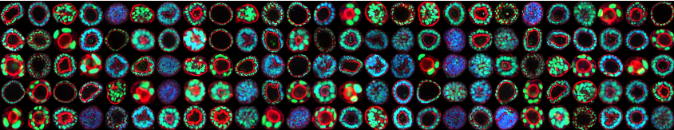
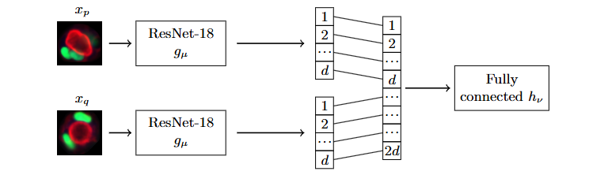

# CLUSTERING ORGANOID IMAGES

**SUPERVISOR:** Jannik Presberger, David Stein  
**CHAIRHOLDER:** Prof. Björn Andres

## 1. Organoid Clustering

In biological and medical research, scientists now routinely acquire microscopy images of hundreds of morphologically heterogeneous organoids and are then faced with the task of finding patterns in the image collection, i.e., subsets of organoids that appear similar and potentially represent the same morphological class.

Since organoids are heterogeneous, we are not interested in classifying but in clustering collections of organoid images.

## 2. Correlation Clustering

Given a finite non-empty set $V$ and costs $c : \binom{V}{2} \rightarrow \mathbb{R}$ we are interested in solutions to the correlation clustering problem:

$$
\min_{y \in \{0,1\}^{\binom{V}{2}}} \sum_{pq \in \binom{V}{2}} c_{pq} y_{pq}
\quad\text{(1)}
$$

subject to:

$$
\forall p \in V\; \forall q \in V \setminus \{p\}\; \forall r \in V \setminus \{p,q\}:\quad y_{pq} + y_{qr} - y_{pr} \leq 1
\quad\text{(2)}
$$

## 3. Estimation of Costs $c_{pq}$

Let $\mathcal{X}$ be the space of organoid images, i.e., $\mathcal{X} = \mathbb{R}^{H \times W}$, where $H$ is the height and $W$ is the width of an organoid image. There are various ways to estimate the cost terms for the correlation clustering problem from these images.

A supervised way to facilitate this is to annotate a small subset of organoid classes and train a twin neural network $f_\theta : \mathcal{X} \times \mathcal{X} \rightarrow \mathbb{R}$ as a binary classifier with logistic loss. This approach has been studied in Presberger et al., 2024. Then we use:

$$
c_{pq} = f(x_p, x_q)
$$

as the costs for correlation clustering.

Another supervised approach is:
- **SupCon** (Khosla et al., 2021)

Other approaches include:
- **SimCLR** (Chen et al., 2020)  
- **DINO** (Caron et al., 2021; Oquab et al., 2024)  
- **SwAV** (Caron et al., 2021)

For a model that learns embeddings on a hypersphere, e.g., $g_\lambda : \mathcal{X} \rightarrow \{z \in \mathbb{R}^d\ |\ \|z\| = 1\}$, we could define the costs $c_{pq}$ as the cosine similarity with a margin $m \in [-1, 1]$:

$$
c_{pq} = m - \frac{g_\lambda(x_p) \cdot g_\lambda(x_q)}{\|g_\lambda(x_p)\|\,\|g_\lambda(x_q)\|}
\quad\text{(3)}
$$

## 4. Project Description

The goal of this project is to implement one of the approaches SupCon, SimCLR, DINO, or SwAV to cluster collections of organoid images. This includes:

1. Literature research  
2. Implementation of either SupCon, SimCLR, DINO or SwAV  
3. Quantitative evaluation in comparison with the supervised approaches reported in Presberger et al., 2024 on a labeled test dataset  
4. Qualitative evaluation on an unlabeled test dataset  
5. Discussion of the results

## References

- Caron, Mathilde et al. (2021). *Unsupervised Learning of Visual Features by Contrasting Cluster Assignments*. [arXiv:2006.09882](https://arxiv.org/abs/2006.09882)  
- Caron, Mathilde et al. (2021). *Emerging Properties in Self-Supervised Vision Transformers*. [arXiv:2104.14294](https://arxiv.org/abs/2104.14294)  
- Chen, Ting et al. (2020). *A Simple Framework for Contrastive Learning of Visual Representations*. [arXiv:2002.05709](https://arxiv.org/abs/2002.05709)  
- Khosla, Prannay et al. (2021). *Supervised Contrastive Learning*. [arXiv:2004.11362](https://arxiv.org/abs/2004.11362)  
- Oquab, Maxime et al. (2024). *DINOv2: Learning Robust Visual Features without Supervision*. [arXiv:2304.07193](https://arxiv.org/abs/2304.07193)  
- Presberger, Jannik et al. (2024). *Correlation Clustering of Organoid Images*. [arXiv:2403.13376](https://arxiv.org/abs/2403.13376)
